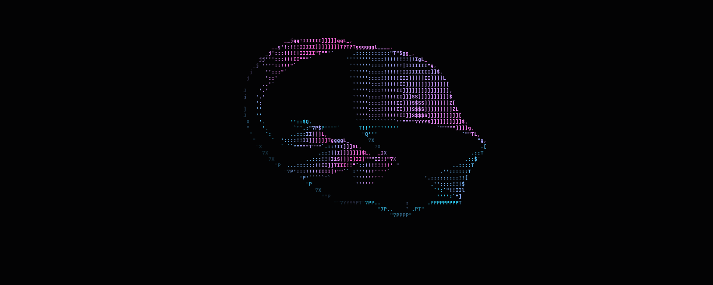
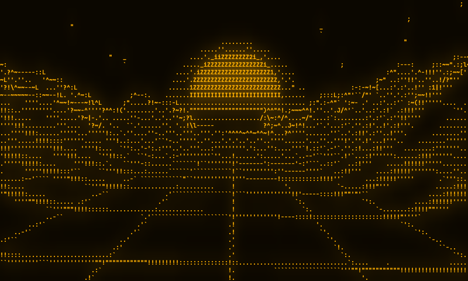
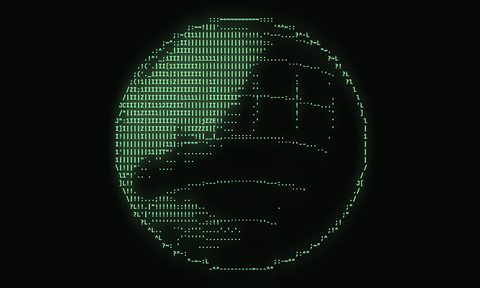
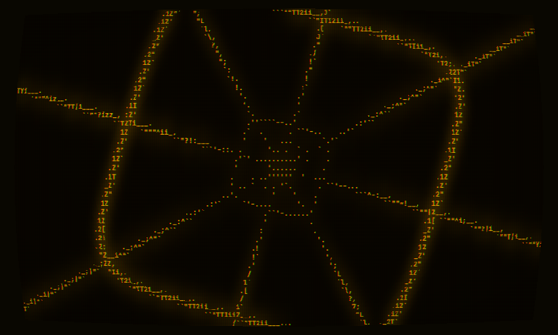

# rummy

**Real-time 3D scenes rendered as ASCII, in WebGL2. Built for hero backgrounds.**



rummy takes a raymarched scene, a video or any canvas and draws it as live text, like a
terminal with a GPU in it. It is small (one ES module, zero dependencies) and cheap: it
shades one sample per *character region*, not per pixel, so a full-screen hero costs about
as much as a thumbnail.

**[Live demo →](https://oddurs.github.io/rummy/)** (drag an image or video onto it) ·
**[Contact sheet →](https://oddurs.github.io/rummy/shots.html)** (every scene in every look) ·
**[Bench →](https://oddurs.github.io/rummy/bench.html)** (GPU time on your machine)

| | | |
|---|---|---|
|  |  |  |

## Why another ASCII shader

Most ASCII effects render the scene at full resolution, then post-process every pixel into
a brightness ramp (` .:-=+*#%@`). That wastes nearly all the shading work and throws away
shape: a diagonal edge and a flat grey patch become the same character.

rummy does two things differently:

1. **It renders the scene at cell resolution.** Each character cell gets 2×3 samples.
   At 1440×900 with 12px text that is ~68k samples instead of ~1.2M pixels, **about 6%
   of the shading cost**. Your scene can afford 100-step raymarches and 5-octave noise.
2. **It picks glyphs by shape, not just brightness.** Every glyph in the font is measured
   once into a 6D "shape vector" (ink coverage in each 2×3 region). Each cell picks the
   glyph whose shape best matches its six samples, so edges come out as `/`, `_`, `|`, `(`
   and silhouettes look drawn rather than dithered. This is the technique from
   [Alex Harri's deep dive](https://alexharri.com/blog/ascii-rendering), run on the GPU.

On top of that, everything that makes it look like a screen rather than a filter, all
computed at cell resolution so it stays nearly free:

- **Silhouettes with direction.** Depth edges become a stroke along the edge's actual
  angle and position, so outlines draw as `/ \ | _` instead of blotches.
- **Temporal anti-aliasing for stills.** A still frame samples jittered points in every
  region over 16 frames and converges to the quality of 4× supersampling. In motion
  there is no jitter: it made sub-cell detail flip between glyphs every frame. Motion
  keeps a light history instead, and measures under 0.25% flicker in every scene.
- **Phosphor glow**, blurred over the cell grid rather than millions of pixels.
- **Two-tone cells**: a background colour per cell, like a real terminal.
- **Palettes** (ANSI, CGA, EGA, C64, Game Boy, phosphors) with ordered dithering.
- **Auto-exposure** for images and video, with no GPU→CPU readback.
- **An opt-in CRT**: curvature, vignette, aperture mask, chromatic fringe, flicker.

And the boring things a background needs: pausing off screen, `prefers-reduced-motion`,
DPR caps, context-loss recovery, any charset, any font.

## Quick start

```sh
pnpm add @oddurs/rummy   # not yet published; see "Status" below
```

```html
<canvas id="hero" style="position:absolute; inset:0; width:100%; height:100%"></canvas>
```

```ts
import { Rummy, scenes } from '@oddurs/rummy';

const rummy = new Rummy(document.querySelector('#hero')!, {
  scene: scenes.terrain,
  fg: '#ffb000',
  bg: '#0b0700',
  fontSize: 12,
});

rummy.set({ edges: 0.8 }); // change anything live
rummy.destroy();           // clean up on unmount
```

### Asciify a video, image or canvas

```ts
const video = document.querySelector('video')!;
new Rummy(canvas, { scene: video, colorMix: 1 });
```

Anything that is a `TexImageSource` works: `<video>`, ``, `<canvas>`, `ImageBitmap`,
`VideoFrame`. That includes a three.js or Babylon canvas, so any existing 3D scene can be
fed in today (see [the roadmap](#roadmap) for a zero-copy path).

### Write your own scene

A scene is a GLSL function that returns a colour and a depth for a point on screen:

```ts
const pulse = /* glsl */ `
vec4 scene(vec2 uv) {
  vec2 p = screen(uv);                       // centred, aspect-correct, y in -1..1
  float r = length(p - uMouse * 0.5);
  float ring = smoothstep(0.05, 0.0, abs(r - 0.5 - 0.1 * sin(uTime * 2.0)));
  return vec4(vec3(ring), r);                // rgb, depth (0 near .. 1 far)
}`;

new Rummy(canvas, { scene: pulse });
```

Available in scenes: `uTime`, `uMouse` (−1..1, smoothed), `uAspect`, `uResolution`,
`uOffset`, and helpers `screen()`, `rot()`, `hash12()`, `hash13()`, `noise()`, `fbm()`
(2D and 3D). Depth only matters for the `edges` silhouette effect; return a constant if
you don't care.

Scenes can declare their own uniforms and have them set live, with no recompile.
Numbers become `float`, booleans `bool`, 2–4 numbers `vec2`–`vec4`, and an image,
video or canvas a `sampler2D` (sample it with `texture(uLogo, uv)`):

```ts
const orb = /* glsl */ `
uniform vec3 uTint;
uniform float uSize;
vec4 scene(vec2 uv) {
  float d = length(screen(uv));
  return vec4(uTint * smoothstep(uSize, uSize - 0.02, d), d);
}`;

const rummy = new Rummy(canvas, { scene: orb, uniforms: { uTint: [1, 0.5, 0.2], uSize: 0.6 } });
rummy.set({ uniforms: { uSize: 0.4 } }); // merges; uTint keeps its value
```

An unknown uniform name logs one warning and is otherwise ignored.

A scene can declare its best moment with `#define STILL 4.0` at the top. rummy starts
there, and it's the frame shown to visitors who prefer reduced motion.

Raymarching tip: avoid `fwidth()` after a loop that `break`s or an early `return`.
Derivatives in non-uniform control flow are undefined, and some GPUs return 0.

Built-in scenes: `ring`, `terrain`, `blobs`, `globe`, `tunnel`.

## Options

All options are optional and can be changed later with `rummy.set()`.

| Option | Default | |
|---|---|---|
| `scene` | `scenes.ring` | GLSL string or `TexImageSource` |
| `fontSize` | `12` | CSS px |
| `fontFamily` | JetBrains Mono → system mono | Any loaded font; the atlas rebuilds when a web font arrives |
| `fontWeight` | `500` | |
| `lineHeight` | `1.25` | Cell height as a multiple of `fontSize` |
| `charset` | `charsets.ascii` | Any string; see `charsets` for presets |
| `mode` | `'shape'` | `'shape'` matches glyph silhouettes, `'density'` is a classic ramp |
| `fg` / `bg` | `#9dffb0` / `#050805` | Any CSS colour; `bg: 'transparent'` to layer over content |
| `colorMix` | `0` | 0 = monochrome `fg`, 1 = scene colour |
| `palette` | `null` | Quantize colours to a palette, e.g. `palettes.cga` (up to 32 colours) |
| `dither` | `1` | Ordered dither across cells when quantizing; 1 spans the gap between neighbouring palette colours |
| `cellBackground` | `0` | Two-tone cells: the darker part of each cell becomes its background |
| `gain` / `gamma` | `0.85` / `1.15` | Tone curve before glyph matching |
| `exposure` | `'source'` | A multiplier, `'auto'`, or `'source'` (auto for images and video, 1 for GLSL) |
| `contrast` | `1.6` | Sharpens shape inside a cell (1 = off) |
| `directionalContrast` | `2` | Sharpens against neighbouring cells (1 = off) |
| `edges` | `0.6` | Directional silhouette strength, 0..1 |
| `antialias` | `0.6` | Stills refine over 16 jittered frames; in motion, how much of the last frame to keep (0 = point samples) |
| `quality` | `1` | `2` supersamples each region 2×2 (4× scene cost) |
| `glow` / `glowRadius` | `0` / `2.5` | Phosphor glow strength, and its radius in cells |
| `crt` | `false` | `true` for a preset, or `{ curvature, vignette, mask, fringe, flicker }` |
| `scanlines` | `0` | Darken alternate pixel rows |
| `offset` | `[0, 0]` | Shift the focal point, e.g. to sit beside your headline |
| `maxFps` | `0` | Cap frame rate (0 = display rate) |
| `maxDpr` | `2` | Device pixel ratio cap |
| `timeScale` | `1` | |
| `mouse` | `true` | Feed the pointer to `uMouse` |
| `pauseOffscreen` | `true` | Stop when scrolled out of view |
| `respectReducedMotion` | `true` | Hold the scene's still frame under `prefers-reduced-motion` |
| `uniforms` | `{}` | Values for the scene's own uniforms; `set({ uniforms })` merges |
| `profile` | `false` | Measure GPU time per pass into `stats.gpu`, and exposure into `stats.exposure` |

Methods: `set(options)`, `play()`, `pause()`, `render()`, `step(seconds)`, `resize()`, `toText()`, `destroy()`.
`step()` advances time and renders one frame exactly as the running loop would, for
recording and deterministic tests.
`toText()` returns the last frame as text, one line per row. It reads back the glyph
grid, not the canvas, so it is cheap: paste a frame into a terminal or a code block.
Properties: `time` (get/set, seconds), `stats` (`columns`, `rows`, `samples`, `width`,
`height`, `fps`, `gpu`), `options`. Static: `Rummy.stillOf(scene)`.

## How it works

```
 scene            exposure        glyph                glow           composite
 cols*2 x rows*3  (auto only)     cols x rows          cols x rows    full resolution
 your GLSL,  ──►  cell luma  ──►  6 samples →     ──►  blur the  ──►  glyph atlas,
 jittered,        → mips → 1x1    contrast, edges,     cells' light   glow, CRT
 accumulated                      nearest glyph,
                                  colour, palette
```

Fullscreen-triangle draws with no vertex buffers and no readbacks. Only the last pass
touches every pixel, and it does two `texelFetch`es. Details, prior art and design
notes are in [docs/how-it-works.md](docs/how-it-works.md).

### What it costs

GPU time per frame at 1920×1080 (12px text, phosphor look with glow), measured with
timer queries on an Apple M4 via `pnpm bench`:

| scene | scene pass | glyph | glow | composite | **total** |
|---|---:|---:|---:|---:|---:|
| ring | 0.26 ms | 0.29 | 0.11 | 0.60 | **1.25 ms** |
| terrain | 0.86 ms | 0.30 | 0.05 | 0.52 | **1.73 ms** |
| blobs | 0.86 ms | 0.25 | 0.17 | 0.28 | **1.55 ms** |
| globe | 0.26 ms | 0.35 | 0.23 | 0.46 | **1.30 ms** |
| tunnel | 0.23 ms | 0.30 | 0.07 | 0.38 | **0.98 ms** |

Per-pass numbers are noisy to about ±0.2 ms; totals are steadier. Other devices are on
[the roadmap](ROADMAP.md). Run `/bench.html` on yours.

## Status

Early (v0.2). The engine, five scenes and the demo work; the API may still change before
1.0. Not yet on npm.

## Roadmap

[ROADMAP.md](ROADMAP.md), generated from the items in `cairn/items/` by
[cairn](https://github.com/oddurs/cairn). Next up: glyph stability in motion, transitions
and scroll (v0.3), your logo in 3D and a three.js adapter (v0.4), a one-tag web component
(v0.5).

## Development

```sh
pnpm install
pnpm dev          # demo at http://localhost:5173 (/shots.html, /bench.html too)
pnpm check        # typecheck, library build, size gate, demo build
pnpm shots        # render the contact sheet to shots/current, diff against shots/baseline
pnpm bench        # GPU time per pass on this machine's real GPU
pnpm measure      # silhouettes, motion flicker, auto-exposure (also run in CI)
pnpm web          # the website (SvelteKit) on http://localhost:4499
```

`src/` is the library, `web/` is the website (SvelteKit with a Node server; see
[web/README.md](web/README.md)), `demo/` is the test harness deployed to GitHub Pages,
and `scripts/` holds the
screenshot harness, bench driver and size gate. They drive headless Chrome over the
DevTools protocol with no npm dependencies. Visual changes show up in CI as a
before/after contact sheet on every pull request.

## License

[MIT](LICENSE)
